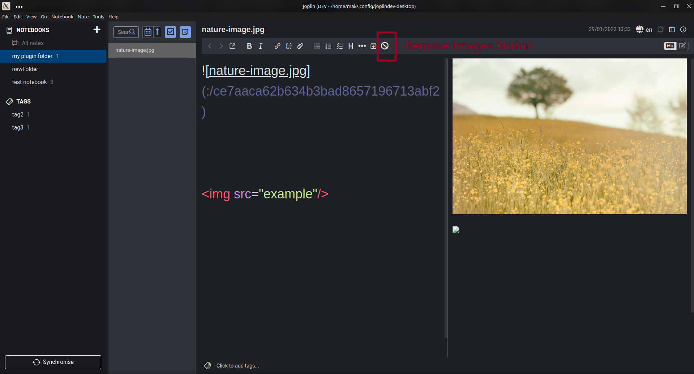
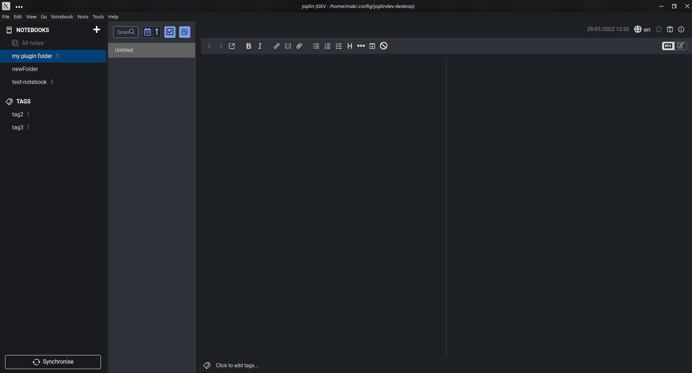

This is Joplin plugin to remove images from selected note. 
To remove images from note just click on "Remove Images Button"

After removing images from note:

Bug: Currently, After removing images from note it scrolls down to bottom of note. This will be fixed soon.